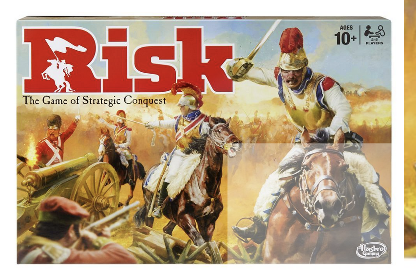
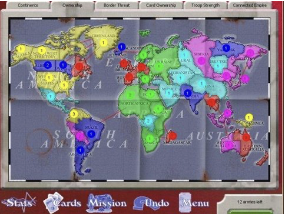

- Module: Software Design and Programming
- Coursework: April to July 2024 study session
- Submission Deadline: Please see the entry under Moodle’s “Assessment” section.

Please note that when the due date is reached, the version you submitted last will be considered your final submission, and it will be the marked version. Once the due date has passed, it will not be possible for you to submit a different version of your assessment. Therefore, you must ensure you have submitted the correct version of your assessment, which you wish to be marked, by the due date.

## Introduction

This project is to be undertaken individually and involves the building of a challengingly extensive `Java` program. The final project delivery has to demonstrate that:

- your code includes many of the `Java` features presented during the module, and that
- you have effectively used the tools presented in the module in your project.

It is key to realize that the project description is purposely incomplete and that it is one of your duties in this project to:

- Elicit and formulate all the missing details before you start the implementation (by asking appropriate questions),
- Limit the scope of the project according to the available time,
- Determine what design decisions will be made, as well as
- What tools will be used for the implementation?

## The Problem

This module’s individual replacement coursework involves building a simple “Risk” computer game.



- [Hasbro Game](https://products.hasbro.com/en-gb/product/risk-game/2C7C6F52-5056-9047-F5DD-EB8AC273BA4C)
- [The rules of the “official” game.](https://instructions.hasbro.com/api/download/B7404_en-us_Risk-Game.pdf)
  - [Risk Game](https://instructions.hasbro.com/en-us/instruction/Risk-Game)

A Risk game consists of a connected graph map representing a world map, where each node is a country, and each edge represents adjacency between countries. Two or more players can play by placing armies on countries they own, from which they can attack adjacent countries to conquer them. The objective of the game is to conquer all countries on the map.

The developed program must be compatible with

- the rules,
- map files, and
- the command-line play of Risk’s [“Domination”](https://sourceforge.net/projects/domination/) version.

The code for the Domination version of the game is provided here which is where your code should also reside. As always, you need to have a “rich” commit history.
We have stated your repository for you with an initial `commit`; you do not need to `push` as there is no remote repository required (unless you want to create one).



There is but one file in this repository (aside from this guide):

- `Domination_install_1.2.7.jar`

To install the game run:

```sh
java -jar Domination_install_1.2.7.jar
```

which will prompt you to select a directory to install the game to. The game will be installed to the selected directory and a shortcut will be created on the desktop.

You should then be able to run the game by double clicking the shortcut on the desktop. If not, then you can run the game by navigating to the installation directory and executing the following command:

```sh
java -jar Domination.jar
```

You should then experiment with the game to ensure that you understand the game play.

## The map

The game map is a connected graph where each node represents a country owned by one of the players. Edges between the nodes represent adjacency between countries.

The map is divided into subgraphs that represent continents. A continent is a connected subgraph of the map graph, and every country belongs to one and only one continent. Each continent is given a control value that determines the number of armies per turn provided to a player that controls all of it. During game play, every country belongs to one and only one player and contains one or more armies that belong to the player owning the land.

In your implementation, it will be expected that the game can be played on any connected subgraph defined by the user before play, saved as a text file representation, and loaded by the game during play.

## The game

### Startup phase

The game starts with the startup phase, where the number of players is determined, and then all the countries are randomly assigned to the players.

### Turn-based play

Then the turn-based play phase begins, in which all players are given a turn in a round-robin fashion. Each player’s turn is divided into three phases:

1. The reinforcement phase,
2. The attack phase, and
3. The fortifications phase.

Once a player is finished with these three phases, the next player’s turn starts.

### Reinforcement phase

In the reinforcements phase, the player is given several armies that depend on the number of countries he owns (# of lands owned divided by three, rounded down). For example, if the player holds all the nations of an entire continent, the player is given several armies corresponding to the continent’s control value.

Finally, if the player owns three cards of different sorts or the same sorts, he can exchange them for armies. The number of troops a player will get for cards is the first five, then increases by five every time any player does so (i.e. five, ten, fifteen, etc.).

In any case, the minimal number of reinforcement armies is three. Once the total number of reinforcements is determined for the player’s turn, the player may place the troops on any country he owns, divided as he wants. The attack phase begins once the player has put all the reinforcement armies.

### Attack phase

In the attack phase, the player may choose one of the countries he owns that contain two or more armies and declare an attack on an adjacent country owned by another player. A battle is then simulated by the attacker rolling at most three dice (which should not be more than the number of armies contained in the attacking country) and the defender rolling at most two dice (which should not be more than the number of troops held in the attacking region).

The outcome of the attack is determined by comparing the defender’s best dice roll with the attacker’s best dice roll. If the defender rolls greater or equal to the attacker, the attacker loses an army; otherwise, the defender loses an army. For example, if the defender rolls two dice, then his other dice roll is compared to the attacker’s second-best dice roll and a second army is lost by the attacker or defender in the same way. The attacker can continue attacking until all his armies or all the defending armies have been eliminated. The attacker captures the territory if all the defender’s troops are eliminated.

The attacking player must then place several armies in the conquered country, greater or equal to the number of dice used in the attack that destroyed the country. A player may do as many episodes as he wants during his turn. Once he declares that he will not attack anymore (or can) because none of his countries with an adjacent land controlled by another player contains more than one army), the fortification phase begins.

### Fortification phase

In the fortification phase, the player may move any number of armies from one of his owned countries to the other, provided that there is a path between these two countries that is composed of countries that he owns. Only one such move is allowed per fortification phase. Once the move is made or the player forfeits his fortification phase, the player’s turn ends and is now the next player’s turn.

### The endgame

- Any player who does not control at least one country is removed from the game.
- The game ends whenever one of the players owns all the countries on the map.

## The cards

A player receives a card at the end of his turn if he successfully conquered at least one country during his turn. Each card is either an

- infantry,
- cavalry, or
- artillery card.

During a player’s reinforcement phase, a player can exchange **three** cards of the same kind or three cards of all different types for several armies that increase every time any player does so. The number of troops a player will get for cards is the first five, then increases by five every time any player does so (i.e., five, ten, fifteen, etc.).

- A player that conquers the last country owned by another player receives all the cards held by that player.
- If a player has five cards during his reinforcement phase, he must exchange three for armies.

## Credits and References

### Associated References

- [Official Risk game rules](https://www.hasbro.com/common/instruct/risk.pdf) by Hasbro (1)
- [Official Risk game rules](https://media.wizards.com/2015/downloads/ah/Risk_rules.pdf) by Hasbro (2)
- Risk game rules by [ultraboardgames.com](https://www.ultraboardgames.com/risk/game-rules.php)
- How to play Risk by [wikihow.com](https://www.wikihow.com/Play-Risk)

### Other similar implemented games

- [Conquest](https://www.windowsgames.co.uk/conquest.html) by Sean O’Connor
- [Online Risk](https://www.pogo.com/games/risk-pogo-domination#game) by Pogo games

### The basis for this coursework assignment

I forget where this one came from; TBC.

## How you will be assessed: Specific Marking Rubric

Your mark will be determined according to the following rubric:

| Criterion                                                                                                                                                       | Weight | full                                     | 3/4                                         | 1/2                                               | 1/4                                                                                  | 0                                                                                   |
| --------------------------------------------------------------------------------------------------------------------------------------------------------------- | ------ | ---------------------------------------- | ------------------------------------------- | ------------------------------------------------- | ------------------------------------------------------------------------------------ | ----------------------------------------------------------------------------------- |
| Requirements ( completeness = system responds to all use scenarios; correctness = all responses are as expected)                                                | 25%    | Correct and complete                     | Correct and mostly complete                 | Mostly correct and mostly complete                | Either mostly incorrect and mostly complete, or mostly incomplete and mostly correct | Either fully incorrect, fully incomplete, or mostly incorrect and mostly incomplete |
| Implementation ( completeness = all required parts (functions, classes, etc.) are present; correctness = their implementation is correct (including data types) | 50%    | Correct and complete                     | Correct and mostly complete                 | Mostly correct and mostly complete                | Either mostly incorrect and mostly complete, or mostly incomplete and mostly correct | Either fully incorrect, fully incomplete, or mostly incorrect and mostly incomplete |
| Unit Testing ( completeness = appropriate variety of scenarios are verified; correctness = tests for them are correctly written)                                | 15%    | Correct and complete                     | Correct and mostly complete                 | Mostly correct and mostly complete                | Either mostly incorrect and mostly complete, or mostly incomplete and mostly correct | Either fully incorrect, fully incomplete, or mostly incorrect and mostly incomplete |
| Development style ( well-structured code = visual readability and non-redundancy; commit history = commits regularly)                                           | 10%    | Well-structured code and regular commits | Well-structured code and one gap in commits | Nearly well-structured code and, at most, one gap | Not well-structured code or more than one gap                                        | Not well-structured code and more than one gap                                      |
